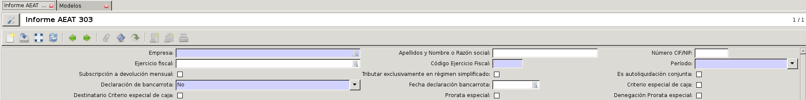
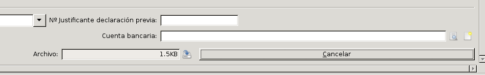

*************************
Generación del modelo 303
*************************
Desde |menu_303| podremos generar, de forma automática, el **Modelo 303**
correspondiente a la Autoliquidación del IVA. Para ello, en la pestaña que nos
aparecerá, deberemos clicar en el icono *Nuevo* para que se nos abra el
formulario del modelo. En este formulario únicamente tendremos que rellenar
la cabecera con la información de nuestra empresa, ya que el resto de campos,
(que están numerados y equivalen a la numeración de los campos del informe
oficial), se rellenarán de forma automática.

Los campos que deberemos rellenar son: |company|, con el nombre de nuestra
empresa; |fiscalyear| donde relacionaremos la declaración con uno de los
ejercicios fiscales de nuestro sistema; |fiscalyear_code| donde deberemos
indicar el año del ejercicio fiscal; |company_vat|; |first_name|; el |period|
sobre el que generaremos el modelo (elegiremos un mes o un trimestre
dependiendo del tipo de fiscalidad que tengamos); y, por último, si nuestra
empresa tiene una |auto_bankruptcy_declaration| también deberemos indicarlo,
así como, en caso afirmativo, la |auto_bankruptcy_date|.

A parte de estos campos, dependiendo del carácter que tenga nuestra
declaración, deberemos marcar o no los siguientes campos:
|monthly_return_subscription|, |recc_receiver|, |simplificated_regime|,
|special_prorate|, |joint_liquidation|, |recc| y |special_prorate_revocation|.

Una vez tengamos todos los campos de la cabecera rellenados conforme al
carácter de nuestra declaración, deberemos ir a la parte inferior derecha del
formulario y clicar en el botón *Calcular*. Esta acción hará que se rellenen el
resto de campos del formulario según la información del IVA de las facturas
introducidas durante el |period|, tanto de cliente como de proveedor. Es por
ello que durante nuestra práctica contable, tendremos que cerciorarnos de que
introducimos todas las facturas de proveedor y de que generamos correctamente
las facturas a los clientes, así tendremos la certeza de que el modelo 303 se
calcula correctamente.

.. note:: Con el cálculo de los campos, el informe todavía no está procesado,
          por lo que, si queremos, podemos revisar o modificar la información
          calculada por el sistema, así como cancelar o pasar a borrador el
          informe en caso necesario. Además, podremos tener el formulario
          calculado tanto tiempo como deseemos.

Para poder hacer la presentación del modelo, y una vez calculado, tendremos que
clicar en el botón *Procesar*, con esto se generará un archivo con el formato
requerido por la AEAT para las presentaciones telemáticas.

.. Para descargar el archivo clicaremos en el icono con forma de disco duro al
lado del campo |file| a la izquierda del botón *Cancelar*. Este archivo será
el que presentaremos telemáticamente en la sede electrónica del AEAT.
          
.. |menu_303| tryref:: aeat_303.menu_aeat_303_report/complete_name
.. |company| field:: aeat.303.report/company
.. |fiscalyear_code| field:: aeat.303.report/fiscalyear_code
.. |company_vat| field:: aeat.303.report/company_vat
.. |period| field:: aeat.303.report/period
.. |auto_bankruptcy_declaration| field:: aeat.303.report/auto_bankruptcy_declaration
.. |auto_bankruptcy_date| field:: aeat.303.report/auto_bankruptcy_date
.. |first_name| field:: aeat.303.report/first_name
.. |fiscalyear| field:: aeat.303.report/fiscalyear
.. |monthly_return_subscription| field:: aeat.303.report/monthly_return_subscription
.. |recc_receiver| field:: aeat.303.report/recc_receiver
.. |simplificated_regime| field:: aeat.303.report/simplificated_regime
.. |special_prorate| field:: aeat.303.report/special_prorate
.. |joint_liquidation| field:: aeat.303.report/joint_liquidation
.. |recc| field:: aeat.303.report/recc
.. |special_prorate_revocation| field:: aeat.303.report/special_prorate_revocation
.. |file| field:: aeat.303.report/file_